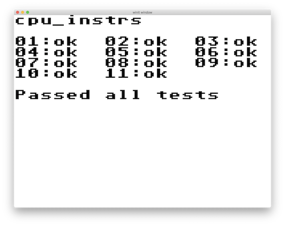

# RustyBoy

RustyBoy is a Gameboy emulator written in Rust for the sole purpose of serving as a verification tool in the development of a complete Gameboy system in an FPGA.

As such, you will notice that the emulator is designed in a way that tries to mimick the environment of FPGA development. It also helps me flesh out and verify implementation ideas before designing in FPGA-land.

## Implementation

RustyBoy's CPU is based on a microcode specification (instructions.csv) that is completely written in a Google Sheets document! The document describes the microcode-level process for each instruction at each T and M cycle.

The microcode csv is then read by src/cpu/asm, which loads, verifies, and compiles the instructions into microcode. This microcode is what is actually used **both** by the Rust emulator, **and** the FPGA CPU.

This has the interesting side-effect that the CPU control unit (control_unit.rs) is relatively simple - almost 260 lines. Most of the heavy lifting is already done!

## Status

The CPU is fully implemented. It passes Blargh's instruction and timing tests.

I am currently working on getting the emulator to pass all of mooneye-gb's acceptance tests.

The GPU is still in progress (background drawing is complete).